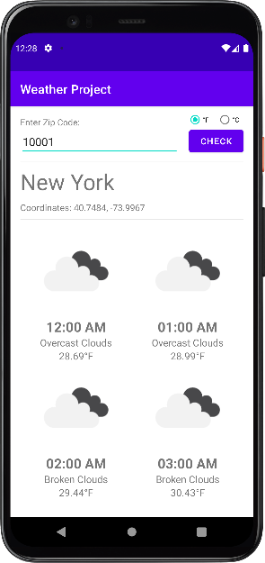
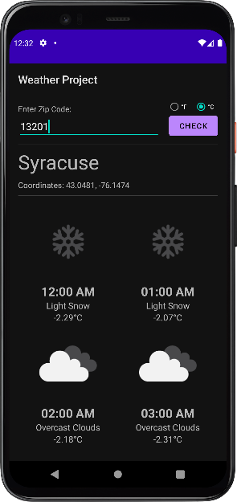

# Simple Weather App
Returns weather for next four hours on entry of a American Zip Code

Features:
- Uses the OpenWeatherMap API to display:
    - Coordinates of entered Zip Code
    - City name
    - Weather for next 4 hours
        - Icon
        - Description
        - Weather in units of user's choice (C/F)
- [Coil](https://coil-kt.github.io/coil/) to load images
- Dark mode support
- Material Design

   

